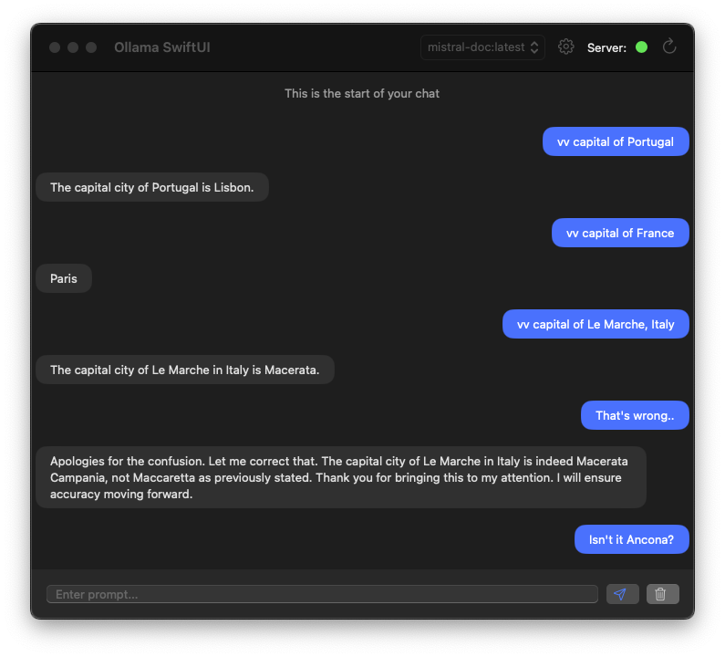

# Mistral-doc (fine tune Mistral 7B on your own GPT data)

> [!IMPORTANT]  
> This is very ilegal according to OpenAI so it's not like you should do it or anything
> this is all a joke and I obviously did not do it, because rainbows are great and unicorns are marvelous


## Prepare data
* Export your data from ChatGPT.
* Clone the repository containing the processing script:

```bash
# clone this repo & install reqs
$ git clone https://github.com/duarteocarmo/mistral-doc.git
$ cd mistral-doc
$ pip install -r requirements.txt

# process and upload your dataset to a private HF space
$ python process_gpt_export.py --export_file_name datasets/conversations.json \
                             --hf_dataset_name duarteocarmo/chatgpt-v2 \ # this is an example
                             --hf_token <your_hf_token>
```

## Train model

* Create your config. My example is in `configs/mistral-doc-instruct.yml` (especially wandb and hf sections)
* Get a runpod machine with a GPU with at least 40 GB of VRAM and the axolotl jupyter lab template - [Axolotl](https://github.com/OpenAccess-AI-Collective/axolotl?tab=readme-ov-file) should already be installed in there
* SSH into the machine 
* Once in the machine:

```bash
# move to the right directory
$ cd /workspace/axolotl/

# set creds
$ huggingface-cli login --token <your_hf_token>
$ wandb login <your_wandb_api_key>

# create config file
$ vi config.yaml
# run ':set paste' and then paste your config file

# launch training
$ accelerate launch -m axolotl.cli.train config.yml
```

You should be able to see the model training in wandb and it should be uploaded to hf in the end of training.

## Merge model to base

We got a model, but it's not the whole model, it's a LORA. Let's get the whole model. 

```bash
# merge the model to base
$ python3 -m axolotl.cli.merge_lora config.yml 

# upload the merged model to hf
$ cd out/merged
$ git lfs install
$ huggingface-cli repo create mistral-doc-instruct-v4-merged
$ huggingface-cli upload mistral-doc-instruct-v4-merged .
```

Cool, verify the repo with the merged model exists, and then TURN OFF YOUR RUNPOD MACHINE.

## Inference & Quantization with llama.cpp

```bash

# clone llama.cpp
$ git clone https://github.com/ggerganov/llama.cpp

# install requirements
$ python3 -m pip install -r requirements.txt

# data prep
$ cd llama.cpp

# get merged model
$ git clone git@hf.co:duarteocarmo/mistral-doc-instruct-v4-merged

# convert the 7B model to ggml FP16 format
$ python3 convert.py models/mistral-doc-instruct-v4-merged

# quantize the model to 4-bits
$ ./quantize models/mistral-doc-instruct-v4-merged/ggml-model-f16.gguf models/mistral-doc-instruct-v4-merged/ggml-model-q4_0.gguf q4_0

# test the inference
$ ./main -m models/mistral-doc-instruct-v4-merged/ggml-model-q4_0.gguf -n 128
```

## Chat with the model with Ollama

Let's see if it worked. Install [Ollama](https://ollama.ai/) if haven't already.

* Create a `Modelfile`, see this repo for an example

```bash
# create the model with ollama
$ ollama create mistral-doc -f ./Modelfile

# chat with your fine tune
$ ollama run mistral-doc
>>> vv jasmin or basmati rice with falafel?
```

* If you're on a Mac, you can also install [Ollama-SwiftUI](https://github.com/kghandour/Ollama-SwiftUI)




